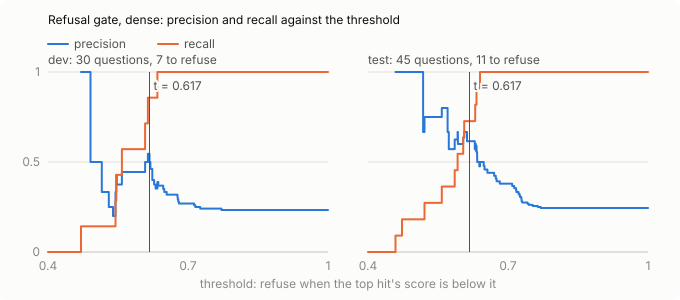
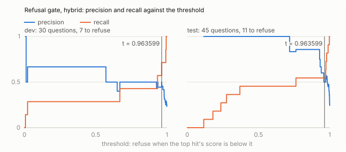

# RAG evaluation

Run `2026-10-06-openai`, collected 2026-10-06. Collection `toolchain_docs`: 3571 chunks (fixed, 800 characters, 120 overlap), embedded with `text-embedding-3-small`. Hybrid mode adds BM25 and a cross-encoder reranker to the dense search.

Golden set: 75 questions (sha256 `6411de51afc2`): ambiguous 6, lookup 37, multi_hop 14, no_answer 18; synthetic 25, targeted 50.

## Retrieval

The 57 answerable questions (every category but no_answer), top 10 hits from `/v1/search`. A hit is relevant to an evidence item if it contains one of the item's quotes; an item found by several hits counts once, at its first rank, so recall and nDCG measure the facts found, not the chunks.

| mode | n | R@1 | R@3 | R@5 | R@10 | MRR@10 | nDCG@10 |
|---|---|---|---|---|---|---|---|
| dense | 57 | 0.471 | 0.622 | 0.675 | 0.763 | 0.678 | 0.661 |
| hybrid | 57 | 0.459 | 0.605 | 0.664 | 0.761 | 0.670 | 0.655 |

### By category

| mode | category | n | R@1 | R@3 | R@5 | R@10 | MRR@10 | nDCG@10 |
|---|---|---|---|---|---|---|---|---|
| dense | ambiguous | 6 | 0.333 | 0.472 | 0.556 | 0.667 | 0.833 | 0.615 |
| dense | lookup | 37 | 0.541 | 0.676 | 0.703 | 0.757 | 0.606 | 0.645 |
| dense | multi_hop | 14 | 0.348 | 0.545 | 0.652 | 0.819 | 0.804 | 0.724 |
| hybrid | ambiguous | 6 | 0.389 | 0.472 | 0.528 | 0.667 | 0.854 | 0.642 |
| hybrid | lookup | 37 | 0.514 | 0.676 | 0.676 | 0.757 | 0.602 | 0.644 |
| hybrid | multi_hop | 14 | 0.345 | 0.476 | 0.690 | 0.812 | 0.769 | 0.691 |

### By origin

Synthetic questions were drafted from one chunk and share its wording, which flatters retrieval: read them against the targeted ones.

| mode | origin | n | R@1 | R@3 | R@5 | R@10 | MRR@10 | nDCG@10 |
|---|---|---|---|---|---|---|---|---|
| dense | synthetic | 25 | 0.560 | 0.720 | 0.760 | 0.800 | 0.639 | 0.678 |
| dense | targeted | 32 | 0.402 | 0.546 | 0.608 | 0.733 | 0.709 | 0.648 |
| hybrid | synthetic | 25 | 0.520 | 0.720 | 0.720 | 0.840 | 0.631 | 0.681 |
| hybrid | targeted | 32 | 0.411 | 0.516 | 0.620 | 0.699 | 0.700 | 0.634 |

### By split

| mode | split | n | R@1 | R@3 | R@5 | R@10 | MRR@10 | nDCG@10 |
|---|---|---|---|---|---|---|---|---|
| dense | dev | 23 | 0.386 | 0.520 | 0.578 | 0.694 | 0.600 | 0.578 |
| dense | test | 34 | 0.529 | 0.691 | 0.740 | 0.809 | 0.731 | 0.717 |
| hybrid | dev | 23 | 0.297 | 0.543 | 0.572 | 0.690 | 0.538 | 0.550 |
| hybrid | test | 34 | 0.569 | 0.647 | 0.725 | 0.809 | 0.759 | 0.726 |

## Snippet size for MCP search

MCP `search` gives an agent each hit cut to its first characters. Evidence recall on the test split (34 answerable questions) with whole chunks and with the snippets an agent sees:

| mode | n | R@3 full | R@3 300 chars | R@5 full | R@5 150 chars |
|---|---|---|---|---|---|
| dense | 34 | 0.691 | 0.272 | 0.740 | 0.120 |
| hybrid | 34 | 0.647 | 0.208 | 0.725 | 0.125 |

Rule: switch MCP from 3 hits of 300 characters to 5 of 150 only if that raises hybrid recall by at least 5 points. Here 5 × 150 is -8.3 points: **keep 3 × 300**.

## Refusal gate

The gate refuses before generating when the top hit's score is below the mode's threshold; a question should be refused if and only if it is no_answer. Each mode's threshold is chosen on the dev split (the highest F1, ties to the lower threshold) and measured on the test split (45 questions, 11 to refuse), with 95 % Wilson intervals; the configured threshold is shown for comparison. Gate only: refusals by the model itself come from the answer run.

| mode | threshold | TP | FP | FN | TN | precision | recall | F1 |
|---|---|---|---|---|---|---|---|---|
| dense | 0.617 (chosen on dev) | 8 | 5 | 3 | 29 | 0.615 [0.36, 0.82] | 0.727 [0.43, 0.90] | 0.667 |
| dense | 0.300 (configured) | 0 | 0 | 11 | 34 | n/a | 0.000 [0.00, 0.26] | 0.000 |
| hybrid | 0.964 (chosen on dev) | 6 | 6 | 5 | 28 | 0.500 [0.25, 0.75] | 0.545 [0.28, 0.79] | 0.522 |
| hybrid | 0.300 (configured) | 4 | 0 | 7 | 34 | 1.000 [0.51, 1.00] | 0.364 [0.15, 0.65] | 0.533 |

