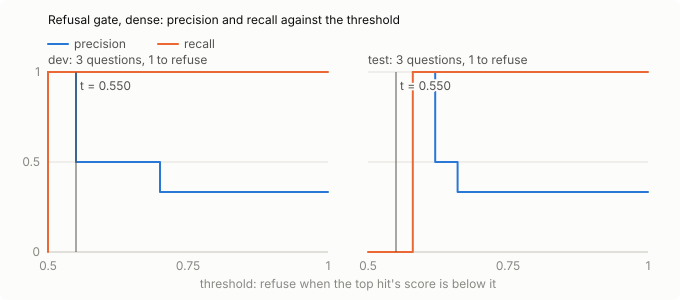
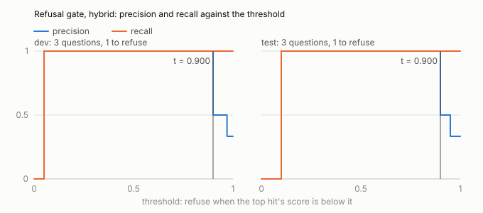

# RAG evaluation

Run `run1`, collected 2026-10-06. Collection `fixture`: 5 chunks (fixed, 800 characters, 120 overlap), embedded with `fake-embedder`. Hybrid mode adds BM25 and a cross-encoder reranker to the dense search.

Golden set: 6 questions (sha256 `e7cebdd625e7`): lookup 3, multi_hop 1, no_answer 2; synthetic 2, targeted 4.

## Retrieval

The 4 answerable questions (every category but no_answer), top 10 hits from `/v1/search`. A hit is relevant to an evidence item if it contains one of the item's quotes; an item found by several hits counts once, at its first rank, so recall and nDCG measure the facts found, not the chunks.

| mode | n | R@1 | R@3 | R@5 | R@10 | MRR@10 | nDCG@10 |
|---|---|---|---|---|---|---|---|
| dense | 4 | 0.625 | 1.000 | 1.000 | 1.000 | 0.875 | 0.888 |
| hybrid | 4 | 1.000 | 1.000 | 1.000 | 1.000 | 1.000 | 1.000 |

### By category

| mode | category | n | R@1 | R@3 | R@5 | R@10 | MRR@10 | nDCG@10 |
|---|---|---|---|---|---|---|---|---|
| dense | lookup | 3 | 0.667 | 1.000 | 1.000 | 1.000 | 0.833 | 0.877 |
| dense | multi_hop | 1 | 0.500 | 1.000 | 1.000 | 1.000 | 1.000 | 0.920 |
| hybrid | lookup | 3 | 1.000 | 1.000 | 1.000 | 1.000 | 1.000 | 1.000 |
| hybrid | multi_hop | 1 | 1.000 | 1.000 | 1.000 | 1.000 | 1.000 | 1.000 |

### By origin

Synthetic questions were drafted from one chunk and share its wording, which flatters retrieval: read them against the targeted ones.

| mode | origin | n | R@1 | R@3 | R@5 | R@10 | MRR@10 | nDCG@10 |
|---|---|---|---|---|---|---|---|---|
| dense | synthetic | 2 | 1.000 | 1.000 | 1.000 | 1.000 | 1.000 | 1.000 |
| dense | targeted | 2 | 0.250 | 1.000 | 1.000 | 1.000 | 0.750 | 0.775 |
| hybrid | synthetic | 2 | 1.000 | 1.000 | 1.000 | 1.000 | 1.000 | 1.000 |
| hybrid | targeted | 2 | 1.000 | 1.000 | 1.000 | 1.000 | 1.000 | 1.000 |

### By split

| mode | split | n | R@1 | R@3 | R@5 | R@10 | MRR@10 | nDCG@10 |
|---|---|---|---|---|---|---|---|---|
| dense | dev | 2 | 0.750 | 1.000 | 1.000 | 1.000 | 1.000 | 0.960 |
| dense | test | 2 | 0.500 | 1.000 | 1.000 | 1.000 | 0.750 | 0.815 |
| hybrid | dev | 2 | 1.000 | 1.000 | 1.000 | 1.000 | 1.000 | 1.000 |
| hybrid | test | 2 | 1.000 | 1.000 | 1.000 | 1.000 | 1.000 | 1.000 |

## Snippet size for MCP search

MCP `search` gives an agent each hit cut to its first characters. Evidence recall on the test split (2 answerable questions) with whole chunks and with the snippets an agent sees:

| mode | n | R@3 full | R@3 300 chars | R@5 full | R@5 150 chars |
|---|---|---|---|---|---|
| dense | 2 | 1.000 | 1.000 | 1.000 | 0.500 |
| hybrid | 2 | 1.000 | 1.000 | 1.000 | 0.500 |

Rule: switch MCP from 3 hits of 300 characters to 5 of 150 only if that raises hybrid recall by at least 5 points. Here 5 × 150 is -50.0 points: **keep 3 × 300**.

## Refusal gate

The gate refuses before generating when the top hit's score is below the mode's threshold; a question should be refused if and only if it is no_answer. Each mode's threshold is chosen on the dev split (the highest F1, ties to the lower threshold) and measured on the test split (3 questions, 1 to refuse), with 95 % Wilson intervals; the configured threshold is shown for comparison. A chosen threshold is printed as the value to configure: the dev score it was chosen at, truncated so that every decision stays the same (the gate refuses strictly below it, so rounding up would refuse that question). Gate only: refusals by the model itself come from the answer run.

| mode | threshold | TP | FP | FN | TN | precision | recall | F1 |
|---|---|---|---|---|---|---|---|---|
| dense | 0.55 (chosen on dev) | 0 | 0 | 1 | 2 | n/a | 0.000 [0.00, 0.79] | 0.000 |
| dense | 0.3 (configured) | 0 | 0 | 1 | 2 | n/a | 0.000 [0.00, 0.79] | 0.000 |
| hybrid | 0.9 (chosen on dev) | 1 | 0 | 0 | 2 | 1.000 [0.21, 1.00] | 1.000 [0.21, 1.00] | 1.000 |
| hybrid | 0.3 (configured) | 1 | 0 | 0 | 2 | 1.000 [0.21, 1.00] | 1.000 [0.21, 1.00] | 1.000 |

### Refusals by no_answer kind

No_answer questions come in kinds: near-miss (the docs cover a neighbouring feature), knows-elsewhere (a fact a model may know from other sources that the pinned docs don't state) and out-of-scope (pricing, roadmaps, benchmarks). How many of each the gate refuses, as counts (each kind has only a few questions); the median is the kind's top score over both splits, and the dev rows are the ones the threshold was chosen on.

| mode | kind | median top score | dev refused (chosen) | test refused (chosen) | test refused (configured) |
|---|---|---|---|---|---|
| dense | near-miss | 0.500 | 1/1 | 0/0 | 0/0 |
| dense | out-of-scope | 0.580 | 0/0 | 0/1 | 0/1 |
| hybrid | near-miss | 0.050 | 1/1 | 0/0 | 0/0 |
| hybrid | out-of-scope | 0.100 | 0/0 | 1/1 | 1/1 |

## Answers

`POST /v1/ask` with `top_k` 5 in both modes, generated by `gpt-4o-mini` (openai). Judge: `fake:scripted prompts fake`.
An answerable question the system refused fails correctness without a judge call, and a no_answer question is correct if and only if it was refused; otherwise an answer passes at a rating of 4 or 5. Faithfulness is the share of an answer's claims that its retrieved contexts support, judged without the reference answer.

| mode | n | correct [95 % CI] | mean rating | faithfulness | fully supported | citations (self-check) | cost/query | P50 ms | P95 ms |
|---|---|---|---|---|---|---|---|---|---|
| dense | 6 | 0.333 [0.10, 0.70] | 4.000 | 0.500 | 0.333 [0.06, 0.79] | n/a | $0.00025 | 900 | 900 |
| hybrid | 6 | 0.833 [0.44, 0.97] | 4.000 | 0.875 | 0.750 [0.30, 0.95] | 0.500 | $0.00027 | 900 | 900 |

The mean rating is over the answers the judge rated (answerable and not refused). The judge rates a complete answer that adds correct detail beyond the reference 4 rather than 5, so the mean understates thorough answers; the pass rate is unaffected. Citations (self-check) is the pipeline's own verdict on its citations, n/a when it doesn't verify them.

### Correct by category

| mode | category | n | correct [95 % CI] | mean rating | faithfulness |
|---|---|---|---|---|---|
| dense | lookup | 3 | 0.333 [0.06, 0.79] | 4.000 | 0.750 |
| dense | multi_hop | 1 | 0.000 [0.00, 0.79] | n/a | n/a |
| dense | no_answer | 2 | 0.500 [0.09, 0.91] | n/a | 0.000 |
| hybrid | lookup | 3 | 0.667 [0.21, 0.94] | 4.000 | 0.833 |
| hybrid | multi_hop | 1 | 1.000 [0.21, 1.00] | 4.000 | 1.000 |
| hybrid | no_answer | 2 | 1.000 [0.34, 1.00] | n/a | n/a |

### Refusals end to end (test split)

The gate and the model together: a refusal by either counts.

| mode | n | TP | FP | FN | TN | precision | recall | F1 | by gate | by model |
|---|---|---|---|---|---|---|---|---|---|---|
| dense | 3 | 0 | 1 | 1 | 1 | 0.000 [0.00, 0.79] | 0.000 [0.00, 0.79] | 0.000 | 1 | 0 |
| hybrid | 3 | 1 | 0 | 0 | 2 | 1.000 [0.21, 1.00] | 1.000 [0.21, 1.00] | 1.000 | 1 | 0 |

### No_answer questions by kind

No_answer questions come in kinds: near-miss (the docs cover a neighbouring feature), knows-elsewhere (a fact a model may know from other sources that the pinned docs don't state) and out-of-scope (pricing, roadmaps, benchmarks). Who declined each one: the gate (before generating), the model (after reading the contexts), or nobody (it was answered).

| mode | kind | split | n | refused by gate | refused by model | answered |
|---|---|---|---|---|---|---|
| dense | near-miss | dev | 1 | 1 | 0 | 0 |
| dense | out-of-scope | test | 1 | 0 | 0 | 1 |
| hybrid | near-miss | dev | 1 | 1 | 0 | 0 |
| hybrid | out-of-scope | test | 1 | 1 | 0 | 0 |

Spend in this run: RAG $0.0031, judge $0.0000 (a cached verdict costs nothing).

### Judge agreement with a human

2 rated answers graded pass or fail by a person who didn't see the judge's verdict: raw agreement 0.500, Cohen's κ 0.000. With this few items, κ is a coarse check.
